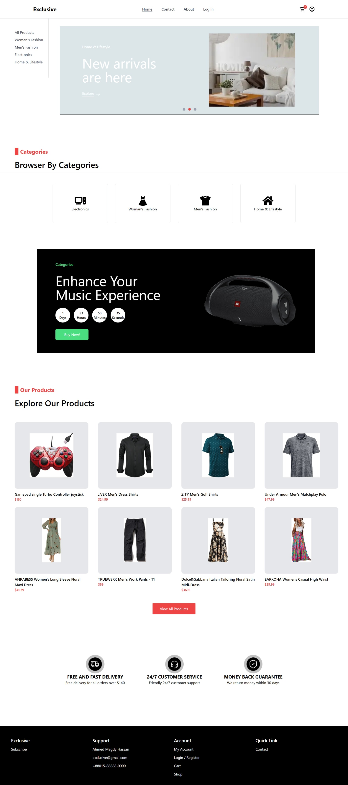
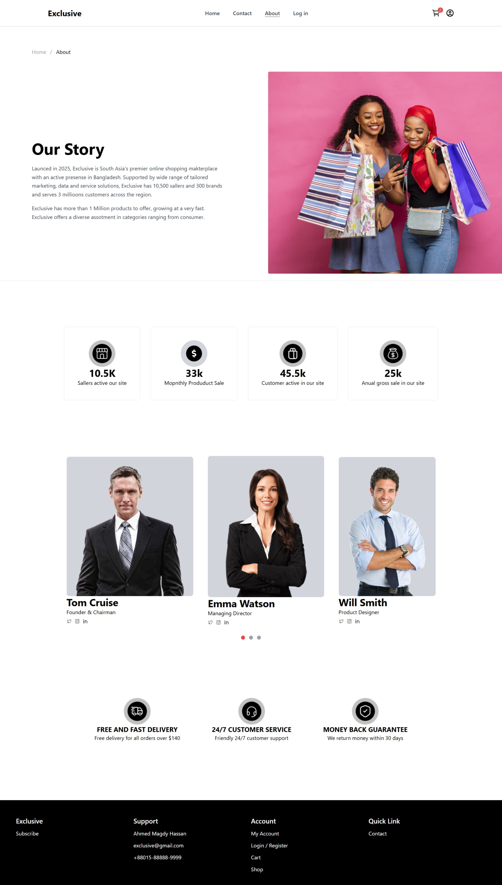

# Exclusive E-commerce

Exclusive E-commerce is a modern, responsive online store built with **React**, **Redux**, **React Router**, and **Firebase**. It features user authentication, Google login, a dynamic product catalog, a shopping cart, and secure checkout simulation.

## Live Demo

Check out the project live here: [Exclusive E-commerce](https://exclusive-ecommerce-chi.vercel.app)

## Features

* User authentication (Email/Password & Google login)
* Firestore database integration for storing user profiles and carts
* Shopping cart with add/remove functionality
* Product listing with categories and product details
* Responsive design for all devices
* Password change and profile editing
* Secure checkout simulation
* Error handling and notifications for login/signup

## Technologies Used

* **React** – Frontend library for building UI
* **Redux Toolkit** – State management
* **React Router v6** – Navigation and routing
* **Firebase** – Authentication and Firestore database
* **Tailwind CSS** – Styling and responsive design
* **React Icons** – Icon library
  

## Installation

1. Clone the repository:

```bash
git clone https://github.com/Ahmed5920/exclusive-ecommerce.git
```

2. Navigate to the project directory:

```bash
cd exclusive-ecommerce
```

3. Install dependencies:

```bash
npm install
```

4. Configure Firebase:

   * Create a Firebase project
   * Enable Email/Password and Google authentication
   * Create Firestore database
   * Add your Firebase config in `src/services/firebase.js`
5. Start the development server:

```bash
npm start
```

The app will be available at [http://localhost:3000](http://localhost:3000).

## Usage

* **Login/Signup:** Users can register with email/password or Google login.
* **Browse Products:** Navigate through categories and view product details.
* **Shopping Cart:** Add products to the cart, adjust quantity, and simulate checkout.
* **Profile:** Users can edit their profile and change passwords.

📷 Screenshots 
<p align="center">
  <br><br>
  
</p>

## Folder Structure

```
src/
├── assets/         # Images and static assets
├── components/     # Reusable UI components
├── pages/          # Application pages
├── services/       # API and Firebase functions
├── store/          # Redux slices
└── App.js          # Main App component
```

## Deployment

You can deploy this project to Vercel, Netlify, or any static hosting provider. Make sure to build the project first:

```bash
npm run build
```

## License

This project is open source and available under the MIT License.

**Author:** Ahmed Magdy
**GitHub:** [https://github.com/Ahmed5920](https://github.com/Ahmed5920)
